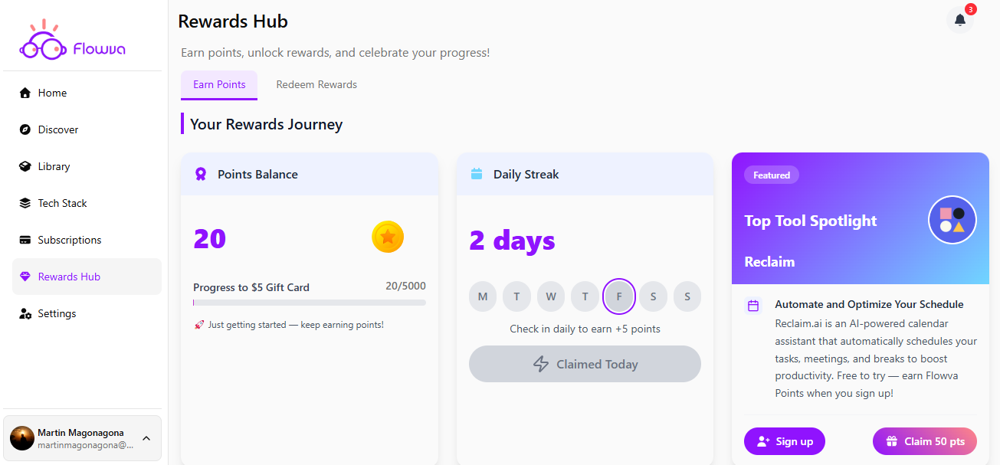

# Flowva Rewards

A React + Supabase rewards application inspired by Flowva Hub, featuring a fully functional Rewards page with user authentication, points tracking, daily streaks, referral systems, and reward redemption.



## Project Overview

Flowva Rewards is a web application that enables users to earn points through daily check-ins, referrals, and featured tool signups. Users can track their progress, maintain daily streaks, and redeem points for various rewards including gift cards and bank transfers. The application features a modern, responsive UI built with React and Supabase, providing secure authentication and real-time data management.

## Tech Stack

### Frontend
- **React 19.2.0** - UI library
- **TypeScript** - Type-safe development
- **Vite 7.2.4** - Build tool and development server
- **Tailwind CSS 4.1.18** - Utility-first CSS framework
- **Shadcn/UI** - High-quality component library built on Radix UI
- **Lucide React** - Icon library
- **Font Awesome** - Additional icon support

### Backend & Database
- **Supabase** - Backend-as-a-Service providing:
  - PostgreSQL database
  - Row Level Security (RLS) policies
  - Authentication (Email/Password & Google OAuth)
  - Real-time subscriptions

### Key Dependencies
- `@supabase/supabase-js` - Supabase client library
- `@radix-ui/*` - Headless UI primitives (used by Shadcn/UI)
- `class-variance-authority` - Component variant management
- `tailwind-merge` - Utility for merging Tailwind classes

## Features Implemented

### ✅ Rewards Page
- **Points Balance Display** - Shows current points with progress bar toward next reward threshold
- **Daily Streak System** - Track consecutive daily check-ins with visual calendar representation
- **Referral System** - Share referral links to earn points when friends join
- **Featured Tools** - Spotlight section for partner tools that award points on signup
- **Reward Redemption** - Browse and filter available rewards by status (All, Unlocked, Locked, Coming Soon)

### ✅ Authentication
- **Email/Password Authentication** - Traditional signup and login
- **Google OAuth** - One-click Google sign-in
  - **Note:** During Google authentication, the Supabase URL is temporarily displayed in the browser due to OAuth verification flow. This is expected behavior.

### ✅ Notifications Modal
- **Notification Popover** - Displays user notifications with badge count
- **Note:** Currently simulated using React state (`DUMMY_NOTIFICATIONS`) rather than dynamic database queries due to time constraints

### ✅ Responsive Design
- Fully responsive layout that works seamlessly on desktop, tablet, and mobile devices
- Mobile-first sidebar navigation
- Adaptive grid layouts for reward cards

## Supabase Schema

The database schema includes the following tables (as defined in `src/lib/supabase.ts`):

### `users` Table
Stores extended user profile information beyond Supabase's built-in auth.users.

| Field | Type | Description |
|-------|------|-------------|
| `id` | `string` (UUID) | Primary key, references `auth.users.id` |
| `timezone` | `string` | User's timezone preference |
| `referral_code` | `string` | Unique referral code for the user |
| `referral_url` | `string` | Complete referral URL |
| `created_at` | `timestamp` | Account creation timestamp |

**Defaults:**
- `timezone` defaults to user's browser/system timezone
- `referral_code` is generated on user creation
- `referral_url` is constructed using the referral code

### `rewards` Table
Tracks user-specific rewards data including points, streaks, and referral statistics.

| Field | Type | Description |
|-------|------|-------------|
| `user_id` | `string` (UUID) | Foreign key to `users.id` |
| `points` | `number` | Current points balance |
| `referrals_count` | `number` | Total number of successful referrals |
| `referral_points_earned` | `number` | Points earned from referrals |
| `next_reward_threshold` | `number` | Points needed for next reward tier |
| `current_streak` | `number` | Consecutive days of daily check-ins |
| `last_claimed_at` | `timestamp` or `null` | Last daily reward claim timestamp |
| `reward_per_day` | `number` | Points awarded per daily check-in |

**Defaults:**
- `points`: 0
- `referrals_count`: 0
- `referral_points_earned`: 0
- `next_reward_threshold`: 5000
- `current_streak`: 0
- `reward_per_day`: 5

### Additional Tables (Planned/Expected)
Based on project requirements, the following tables should exist but are not yet fully integrated in the TypeScript schema:

#### `reward_items` Table (Expected Schema)
| Field | Type | Description |
|-------|------|-------------|
| `id` | `integer` | Primary key |
| `title` | `string` | Reward name |
| `description` | `text` | Reward description |
| `points_required` | `integer` | Points needed to redeem |
| `status` | `enum` | Status: 'Locked', 'Unlocked', 'Coming Soon' |
| `icon` | `string` | Icon identifier |
| `created_at` | `timestamp` | Creation timestamp |

#### `notifications` Table (Expected Schema)
| Field | Type | Description |
|-------|------|-------------|
| `id` | `integer` | Primary key |
| `user_id` | `string` (UUID) | Foreign key to `users.id` |
| `title` | `string` | Notification title |
| `description` | `text` | Notification message |
| `read` | `boolean` | Read status |
| `created_at` | `timestamp` | Notification timestamp |

#### `featured_tools` Table (Expected Schema)
| Field | Type | Description |
|-------|------|-------------|
| `id` | `string` | Primary key |
| `name` | `string` | Tool name |
| `short_bio` | `string` | Short tagline |
| `description` | `text` | Full description |
| `points` | `integer` | Points awarded on signup |
| `signup_url` | `string` | External signup URL |
| `image_url` | `string` | Tool logo/image path |
| `is_active` | `boolean` | Whether tool is currently featured |
| `created_at` | `timestamp` | Creation timestamp |

**Note:** Currently, `reward_items`, `notifications`, and `featured_tools` are implemented as mock data in the frontend (`REWARDS_DATA`, `DUMMY_NOTIFICATIONS`, `FEATURED_TOOLS` arrays) and should be migrated to database tables for full functionality.

## Row Level Security (RLS) Policies

RLS policies should be configured in Supabase to ensure data security. The following policies are recommended:

### `users` Table Policies
- **SELECT**: Users can read their own profile only (`auth.uid() = id`)
- **UPDATE**: Users can update their own profile only (`auth.uid() = id`)
- **INSERT**: Handled automatically via database triggers or service role on user signup

### `rewards` Table Policies
- **SELECT**: Users can read their own rewards data only (`auth.uid() = user_id`)
- **UPDATE**: Users can update their own rewards data only (`auth.uid() = user_id`)
- **INSERT**: Handled automatically on user creation or via service role

### `reward_items` Table Policies (When Implemented)
- **SELECT**: All authenticated users can read reward items (`auth.role() = 'authenticated'`)
- **UPDATE/INSERT/DELETE**: Service role only (admin operations)

### `notifications` Table Policies (When Implemented)
- **SELECT**: Users can read their own notifications only (`auth.uid() = user_id`)
- **UPDATE**: Users can mark their own notifications as read (`auth.uid() = user_id`)
- **INSERT**: Service role or database triggers only
- **DELETE**: Users can delete their own notifications (`auth.uid() = user_id`)

### `featured_tools` Table Policies (When Implemented)
- **SELECT**: All authenticated users can read active featured tools (`auth.role() = 'authenticated' AND is_active = true`)
- **UPDATE/INSERT/DELETE**: Service role only (admin operations)

**Note:** To enable RLS, execute `ALTER TABLE table_name ENABLE ROW LEVEL SECURITY;` in Supabase SQL Editor, then create the appropriate policies using `CREATE POLICY` statements.

## Trade-offs & Assumptions

### Current Limitations

1. **Notifications System**
   - Notifications are currently simulated using React state (`DUMMY_NOTIFICATIONS`) rather than fetched from the database
   - This was a conscious trade-off due to time constraints during development
   - Full implementation would require:
     - `notifications` table in Supabase
     - Real-time subscriptions or polling for new notifications
     - Backend logic to create notifications on user actions

2. **Authentication-First Approach**
   - Authentication wasn't implemented early in the development cycle
   - Some dynamic content is currently limited because the database schema and queries were not fully connected
   - This created a working auth flow but required mock data for rewards, notifications, and featured tools

3. **If Rewritten: Recommended Workflow**
   - **Phase 1**: Database schema design and RLS policies
   - **Phase 2**: Authentication & dynamic routes
   - **Phase 3**: UI components with real data integration
   - **Phase 4**: Polish and optimization

4. **Google OAuth Branding**
   - The Supabase URL displays during Google OAuth flow due to verification requirements
   - This is expected behavior but could be improved with custom OAuth branding in Supabase settings

5. **Mock Data Usage**
   - Current implementation uses mock data arrays for:
     - Rewards items (`REWARDS_DATA` in `redeem-rewards.tsx`)
     - Notifications (`DUMMY_NOTIFICATIONS` in `notification-popover.tsx`)
     - Featured tools (`FEATURED_TOOLS` in `featured-tools.tsx`)
     - User rewards state (`MOCK_REWARDS_STATE` in `earn-points.tsx`)
   - These should be replaced with Supabase queries in production

## Setup Instructions

### Prerequisites
- Node.js 18+ and npm
- A Supabase account and project
- Git (for cloning the repository)

### Step 1: Clone the Repository
```bash
git clone <repository-url>
cd flowva-rewards
```

### Step 2: Install Dependencies
```bash
npm install
```

### Step 3: Environment Variables
Create a `.env` file in the root directory:

```env
VITE_SUPABASE_URL=your_supabase_project_url
VITE_SUPABASE_ANON_KEY=your_supabase_anon_key
```

To get these values:
1. Go to your Supabase project dashboard
2. Navigate to Settings → API
3. Copy the "Project URL" as `VITE_SUPABASE_URL`
4. Copy the "anon public" key as `VITE_SUPABASE_ANON_KEY`

**Security Note:** Never commit the `.env` file to version control. It should already be in `.gitignore`.

### Step 4: Database Setup

1. **Create Tables**: Run the following SQL in your Supabase SQL Editor:

```sql
-- Create users table
CREATE TABLE IF NOT EXISTS public.users (
    id UUID PRIMARY KEY REFERENCES auth.users(id) ON DELETE CASCADE,
    timezone TEXT DEFAULT 'UTC',
    referral_code TEXT NOT NULL UNIQUE,
    referral_url TEXT NOT NULL,
    created_at TIMESTAMPTZ DEFAULT NOW()
);

-- Create rewards table
CREATE TABLE IF NOT EXISTS public.rewards (
    user_id UUID PRIMARY KEY REFERENCES public.users(id) ON DELETE CASCADE,
    points INTEGER DEFAULT 0,
    referrals_count INTEGER DEFAULT 0,
    referral_points_earned INTEGER DEFAULT 0,
    next_reward_threshold INTEGER DEFAULT 5000,
    current_streak INTEGER DEFAULT 0,
    last_claimed_at TIMESTAMPTZ,
    reward_per_day INTEGER DEFAULT 5
);

-- Enable RLS
ALTER TABLE public.users ENABLE ROW LEVEL SECURITY;
ALTER TABLE public.rewards ENABLE ROW LEVEL SECURITY;

-- Create RLS policies for users
CREATE POLICY "Users can read own profile"
    ON public.users FOR SELECT
    USING (auth.uid() = id);

CREATE POLICY "Users can update own profile"
    ON public.users FOR UPDATE
    USING (auth.uid() = id);

-- Create RLS policies for rewards
CREATE POLICY "Users can read own rewards"
    ON public.rewards FOR SELECT
    USING (auth.uid() = user_id);

CREATE POLICY "Users can update own rewards"
    ON public.rewards FOR UPDATE
    USING (auth.uid() = user_id);
```

2. **Set Up Authentication**: In Supabase Dashboard → Authentication → Providers:
   - Enable Email provider
   - Enable Google OAuth (configure with Google OAuth credentials)
   - Set redirect URLs to include your local development URL (e.g., `http://localhost:5173`)

### Step 5: Run the Development Server
```bash
npm run dev
```

The application will be available at `http://localhost:5173` (or the port Vite assigns).

### Step 6: Build for Production
```bash
npm run build
```

The production build will be in the `dist` directory.

### Step 7: Preview Production Build
```bash
npm run preview
```

## Usage Instructions

### Authentication

1. **Sign Up**:
   - Click "Sign up" on the auth page
   - Enter email and password (minimum 6 characters)
   - Check your email for confirmation link (if email confirmation is enabled)
   - Alternatively, click "Sign up with Google" for OAuth authentication

2. **Log In**:
   - Enter your email and password
   - Or use "Sign in with Google" button
   - Note: The Supabase URL will appear briefly during Google OAuth redirect

### Using the Rewards Page

1. **View Points Balance**:
   - Points are displayed in the "Points Balance" card
   - Progress bar shows progress toward the next reward threshold (default: 5000 points)

2. **Daily Streak**:
   - Click "Claim Daily Reward" button once per day
   - Earn points (default: 5 points) and maintain your streak
   - Calendar visualization shows the current week

3. **Refer & Earn**:
   - Copy your personal referral link from the "Share Your Link" card
   - Share via social media buttons or direct link
   - Earn 25 points when a friend signs up using your link
   - Track referrals and points earned in the stats section

4. **Featured Tools**:
   - View featured partner tools in the "Top Tool Spotlight" card
   - Click "Sign up" to visit the tool's signup page
   - Click "Claim X pts" after signing up (points are awarded manually in current implementation)

5. **Redeem Rewards**:
   - Navigate to the "Redeem Rewards" tab
   - Filter rewards by status: All, Unlocked, Locked, or Coming Soon
   - View reward details and required points
   - **Note:** Redemption functionality is currently disabled (rewards are marked as "Locked")

6. **Notifications**:
   - Click the bell icon in the top navigation bar
   - View notifications list (currently simulated)
   - Delete individual notifications or delete all
   - **Note:** Notifications are currently mock data and not persisted

## Deployment

### Live Deployment
The application can be deployed to various platforms:

#### Vercel (Recommended)
1. Push code to GitHub
2. Import project in Vercel
3. Add environment variables (`VITE_SUPABASE_URL`, `VITE_SUPABASE_ANON_KEY`)
4. Deploy

#### Netlify
1. Push code to GitHub
2. Create new site from Git in Netlify
3. Add environment variables in Site settings → Environment variables
4. Build command: `npm run build`
5. Publish directory: `dist`
6. Deploy

#### Other Platforms
The application is a standard Vite React app and can be deployed to any static hosting service:
- GitHub Pages
- AWS S3 + CloudFront
- Azure Static Web Apps
- Cloudflare Pages

### Environment Variables in Production
Ensure the following environment variables are set in your deployment platform:
- `VITE_SUPABASE_URL`
- `VITE_SUPABASE_ANON_KEY`

Also update Supabase Authentication → URL Configuration:
- Add your production URL to "Redirect URLs"
- Update "Site URL" to your production domain

## Future Improvements

### High Priority
1. **Dynamic Notifications System**
   - Migrate from mock data to `notifications` table
   - Implement real-time subscriptions for new notifications
   - Add notification creation triggers for user actions (daily check-in, referral, etc.)
   - Implement "Mark as read" functionality

2. **Complete Database Integration**
   - Replace all mock data arrays with Supabase queries
   - Implement proper data fetching with loading states and error handling
   - Add optimistic updates for better UX

3. **Reward Redemption Flow**
   - Enable reward redemption when user has sufficient points
   - Implement reward fulfillment workflow
   - Add reward history tracking

4. **Google OAuth Branding**
   - Configure custom OAuth branding in Supabase
   - Reduce visibility of Supabase URL during auth flow

### Medium Priority
5. **Enhanced Daily Streak System**
   - Add streak milestone rewards
   - Implement streak recovery mechanisms
   - Add streak history visualization

6. **Referral System Enhancements**
   - Automatic referral detection and point awarding
   - Referral analytics dashboard
   - Referral contest leaderboard

7. **Featured Tools Management**
   - Admin interface for managing featured tools
   - Automatic point awarding when users sign up via links
   - Tool signup tracking and analytics

8. **User Profile Management**
   - Profile settings page
   - Avatar upload
   - Timezone preferences

### Low Priority
9. **Performance Optimizations**
   - Implement React Query or SWR for data caching
   - Add service workers for offline support
   - Optimize bundle size with code splitting

10. **Additional Features**
    - Email notifications
    - Push notifications (via service workers)
    - Social sharing enhancements
    - Achievement badges system
    - Points transaction history

## Project Structure

```
flowva-rewards/
├── public/                 # Static assets
│   ├── flowva-logo.png
│   ├── goldstar.svg
│   └── reclaim.png
├── src/
│   ├── components/
│   │   ├── auth/          # Authentication components
│   │   ├── rewards/       # Rewards page components
│   │   │   └── tabs/      # Tab components (earn, redeem, featured)
│   │   ├── ui/            # Shadcn/UI components
│   │   ├── app-sidebar.tsx
│   │   ├── navbar.tsx
│   │   └── notification-popover.tsx
│   ├── context/           # React contexts
│   │   └── auth-context.tsx
│   ├── hooks/             # Custom React hooks
│   ├── lib/               # Utilities and configurations
│   │   ├── supabase.ts    # Supabase client and types
│   │   └── utils.ts
│   ├── App.tsx            # Main app component
│   ├── main.tsx           # Application entry point
│   └── index.css          # Global styles
├── .env                   # Environment variables (not in git)
├── components.json        # Shadcn/UI configuration
├── package.json
├── tsconfig.json
├── vite.config.ts
└── README.md
```
## Author
-Martin Jack

## Support

For issues, questions, or contributions, please [open an issue](link-to-issues) in the repository.
```
